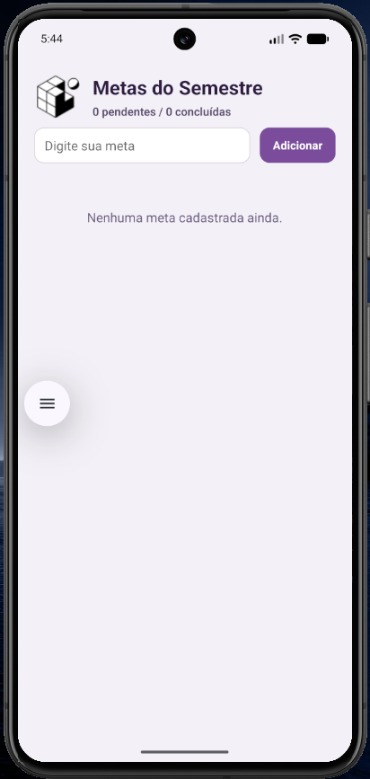
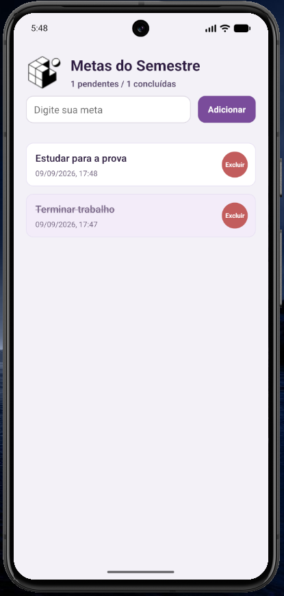
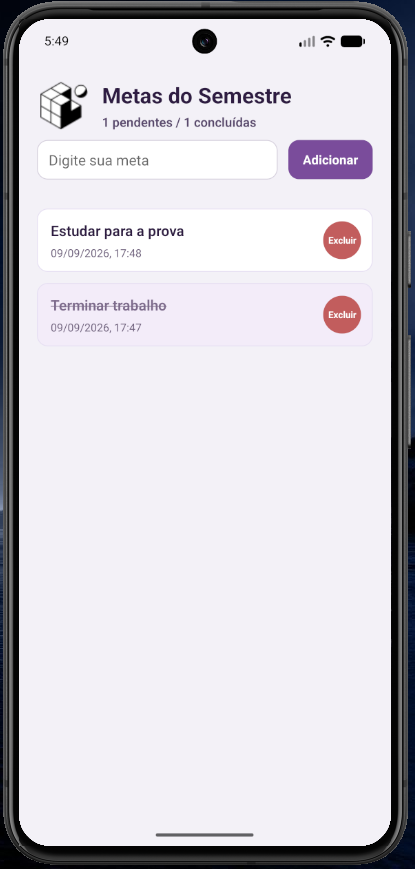

# MetasSemestre - App de Metas Acadêmicas

Aplicativo mobile em React Native (Expo) para gestão de metas acadêmicas, com persistência local e organização por componentes.

## 📱 Funcionalidades
- Cadastro de metas com validação de texto vazio e alertas amigáveis.
- Estado gerenciado com `useState` e IDs únicos gerados por timestamp.
- Remoção de itens com `filter` e feedback visual em `Pressable`.
- Marcação de conclusão com estilo riscado e contador de pendentes/concluídas.
- Persistência local em `AsyncStorage` com carregamento e salvamento automáticos via `useEffect`.

## ⚙️ Onde estão os `useEffect`?
- **Carregamento inicial:** no arquivo `App.js`, dentro do primeiro `useEffect`, que lê a chave `@metas_semestre` ao montar o componente. Ele evita salvar antes da primeira carga e usa `try/catch` para tratar falhas de leitura.
- **Salvamento automático:** no segundo `useEffect`, que dispara sempre que `metas` ou `carregada` mudam. Esse efeito serializa o array em `JSON.stringify` e grava com `AsyncStorage.setItem`.

## 📸 Prints do app

## 🧩 Estrutura principal
- `App.js`: composição da tela, estado principal, persistência e contadores.
- `components/MetaInput.js`: campo de texto e botão de adicionar.
- `components/MetaList.js`: lista rolável com itens, exclusão e toggle de conclusão.
- `labels.js`: textos visuais do app.
